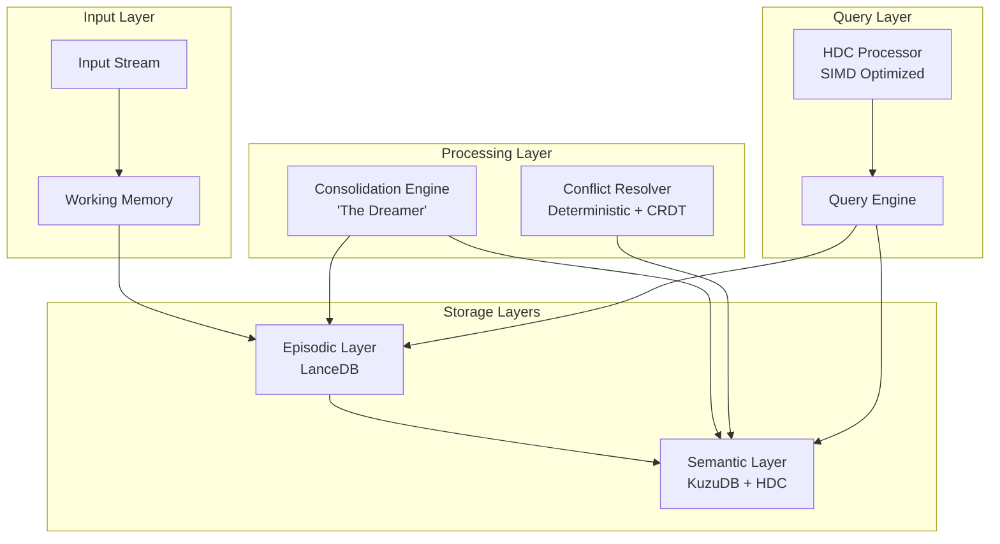

# Cognitive Memory Database (CMD) - Production Specification

## Краткое описание
Cognitive Memory Database (CMD) - это новое поколение системы хранения памяти для AGI, которая моделирует биологические процессы памяти человеческого мозга. Система объединяет векторные представления, графы знаний и гиперразмерные вычисления для создания активной, эволюционирующей памяти.

## Оглавление
1. [Архитектура системы](#архитектура-системы)
2. [Компоненты и технологии](#компоненты-и-технологии)
3. [Детальная спецификация](#детальная-спецификация)
4. [План реализации](#план-реализации)
5. [API и интерфейсы](#api-и-интерфейсы)
6. [Производительность и бенчмарки](#производительность-и-бенчмарки)

## Архитектура системы

### Трёхуровневая модель PAD (Persistence, Active consolidation, Decay)



### Поток данных

1. **Ingestion Pipeline**
   - Асинхронная запись в очередь
   - Векторизация (dense + sparse + HDC)
   - Временная индексация

2. **Consolidation Pipeline**
   - Кластеризация похожих событий
   - Извлечение фактов и отношений
   - Разрешение конфликтов через CRDT
   - Обновление графа знаний

3. **Query Pipeline**
   - Гибридный поиск (vector + graph + temporal)
   - HDC-фильтрация для ускорения
   - Применение функции забывания

## Компоненты и технологии

### Core Stack
- **Язык**: Rust (производительность + безопасность памяти)
- **Векторная БД**: LanceDB (embedded, disk-based, Arrow-native)
- **Графовая БД**: KuzuDB (embedded, Cypher-compatible)
- **HDC**: Custom implementation с SIMD оптимизациями
- **Python SDK**: PyO3 для интеграции с ML экосистемой

### Ключевые инновации

#### 1. Детерминированное разрешение конфликтов
```rust
pub struct ConflictResolver {
    strategies: HashMap<ConflictType, ResolutionStrategy>,
    crdt_engine: CRDTEngine,
    logic_checker: DatalogEngine,
    fallback_llm: Option<LocalLLM>,
}

pub enum ConflictType {
    TemporalSupersession,    // t1 < t2, fact2 заменяет fact1
    AttributeUpdate,         // Обновление поля сущности
    ContradictoryFacts,      // A и ¬A одновременно
    PartialOverlap,          // Частичное пересечение множеств
    CausalChain,            // A→B, B→C, A→¬C
    SourceDisagreement,     // Разные источники утверждают разное
}

pub enum ResolutionStrategy {
    // Детерминированные (95% случаев)
    KeepNewest,              // По timestamp
    MergeViaСRDT,           // LWW-Element-Set
    TrustHigherSource,       // По рейтингу доверия
    ApplyLogicRules,         // Datalog inference

    // Полудетерминированные (4%)
    LocalLLM(Phi3),         // 3B модель локально

    // Недетерминированные (1%)
    DeferToUser,            // UI prompt
    RemoteLLM,              // GPT-4 fallback
}
```

#### 2. Версионирование фактов через CRDT
```rust
pub struct FactVersion {
    id: Uuid,
    content: FactPayload,
    vector_clock: VectorClock,
    lamport_timestamp: u64,
    confidence: f32,
    sources: Vec<SourceId>,
    supersedes: Option<FactId>,
    metadata: FactMetadata,
}

impl CRDT for FactVersion {
    type Atom = FactAtom;

    fn merge(&self, other: &Self) -> Self {
        match self.vector_clock.partial_cmp(&other.vector_clock) {
            Some(Ordering::Less) => other.clone(),
            Some(Ordering::Greater) => self.clone(),
            _ => self.merge_concurrent(other), // LWW-Element-Set
        }
    }
}
```

#### 3. Математическая модель забывания
```rust
pub struct RetentionModel {
    base_retention: f32,      // S₀ - начальная важность
    decay_rate: f32,          // α - скорость забывания
    stability: f32,          // τ - стабильность памяти
    last_recall: SystemTime,  // t_last
}

impl RetentionModel {
    pub fn retention_strength(&self, now: SystemTime) -> f32 {
        let t_delta = now.duration_since(self.last_recall).as_secs() as f32;
        self.base_retention * (-t_delta / self.stability).exp()
    }

    pub fn update_on_recall(&mut self, success: bool) {
        if success {
            self.stability *= 1.5;  // Spaced repetition boost
        } else {
            self.stability *= 0.9;  // Decay acceleration
        }
        self.last_recall = SystemTime::now();
    }
}
```

#### 4. HDC для структурного поиска
```rust
pub struct HDCProcessor {
    dimension: usize,  // 10,000
    seed_vectors: HashMap<Symbol, BitVec>,
}

impl HDCProcessor {
    // Кодирование триплета (Subject, Predicate, Object)
    pub fn encode_triple(&self, s: &Symbol, p: &Symbol, o: &Symbol) -> BitVec {
        let s_vec = &self.seed_vectors[s];
        let p_vec = &self.seed_vectors[p];
        let o_vec = &self.seed_vectors[o];

        // Binding: XOR для создания уникальной комбинации
        s_vec.xor(p_vec).xor(o_vec)
    }

    // Кодирование графа как суперпозиции триплетов
    pub fn encode_graph(&self, triples: &[Triple]) -> BitVec {
        let mut graph_vec = BitVec::new(self.dimension);

        for triple in triples {
            let triple_vec = self.encode_triple(&triple.s, &triple.p, &triple.o);
            // Bundling: majority voting
            graph_vec = graph_vec.bundle(&triple_vec);
        }

        graph_vec
    }

    // Проверка наличия подграфа за O(1)
    pub fn contains_subgraph(&self, graph: &BitVec, query: &BitVec) -> f32 {
        let hamming = graph.hamming_distance(query);
        1.0 - (hamming as f32 / self.dimension as f32)
    }
}
```

## Детальная спецификация

### Структуры данных

#### MemoryUnit - базовая единица памяти
```rust
pub struct MemoryUnit {
    // Идентификация
    id: Uuid,                    // UUIDv7 для временной сортировки

    // Контент
    modality: Modality,          // text, image, audio, structured
    content: Vec<u8>,            // Raw payload

    // Векторные представления
    dense_vector: Vec<f32>,      // 1536d OpenAI/Cohere
    sparse_vector: HashMap<u32, f32>, // BM25/SPLADE
    hdc_signature: BitVec,       // 10000d структурный вектор

    // Временные характеристики
    created_at: SystemTime,
    last_accessed: SystemTime,
    access_count: u32,
    retention: RetentionModel,

    // Связи
    graph_links: Vec<GraphLink>,
    source: SourceMetadata,
}
```

#### GraphNode - узел в семантической сети
```rust
pub struct GraphNode {
    id: NodeId,
    node_type: NodeType,        // Entity, Event, Concept, Rule
    label: String,

    // Атрибуты с версионированием
    attributes: CRDT<AttributeMap>,

    // Векторы для поиска
    embedding: Vec<f32>,
    hdc_context: BitVec,        // Кодирует локальную топологию

    // Метаданные
    confidence: f32,
    sources: Vec<SourceId>,
    created: SystemTime,
    modified: SystemTime,
}

pub struct GraphEdge {
    id: EdgeId,
    from_node: NodeId,
    to_node: NodeId,
    edge_type: EdgeType,        // IS_A, HAS_PROPERTY, CAUSES, etc
    weight: f32,
    temporal_validity: Option<TimeRange>,
    metadata: EdgeMetadata,
}
```

### Алгоритмы

#### Консолидация памяти
```rust
pub async fn consolidate_memories(
    episodic: &LanceDB,
    semantic: &KuzuDB,
    window: Duration,
) -> Result<ConsolidationReport> {
    // 1. Извлечение свежих эпизодов
    let episodes = episodic.query()
        .filter(|e| e.created_at > SystemTime::now() - window)
        .filter(|e| !e.is_consolidated)
        .collect().await?;

    // 2. Кластеризация
    let clusters = cluster_episodes(&episodes, ClusterConfig {
        algorithm: DBSCAN,
        epsilon: 0.3,
        min_points: 3,
    });

    // 3. Синтез фактов из кластеров
    let mut new_facts = Vec::new();
    for cluster in clusters {
        if cluster.coherence_score() > 0.7 {
            let fact = synthesize_fact(&cluster)?;
            new_facts.push(fact);
        }
    }

    // 4. Разрешение конфликтов и вставка в граф
    let resolver = ConflictResolver::new();
    for fact in new_facts {
        match semantic.check_conflicts(&fact).await? {
            None => semantic.insert(fact).await?,
            Some(conflicts) => {
                let resolved = resolver.resolve(&fact, &conflicts)?;
                semantic.upsert(resolved).await?;
            }
        }
    }

    // 5. Маркировка эпизодов как обработанных
    episodic.mark_consolidated(&episodes).await?;

    Ok(ConsolidationReport {
        processed: episodes.len(),
        facts_created: new_facts.len(),
    })
}
```

#### Гибридный поиск с HDC-ускорением
```rust
pub async fn hybrid_search(
    query: &str,
    constraints: SearchConstraints,
) -> Result<Vec<SearchResult>> {
    // 1. Векторизация запроса
    let q_dense = embed_dense(query).await?;
    let q_sparse = embed_sparse(query);
    let q_hdc = encode_query_structure(query);

    // 2. Параллельный поиск
    let (vector_results, graph_results) = tokio::join!(
        search_vectors(&q_dense, &q_sparse),
        search_graph_with_hdc(&q_hdc)
    );

    // 3. Fusion с учетом забывания
    let mut results = fusion_results(
        vector_results,
        graph_results,
        constraints.hybrid_alpha
    );

    // 4. Применение временного decay
    for result in &mut results {
        let retention = result.memory.retention.retention_strength(SystemTime::now());
        result.score *= retention;
    }

    // 5. Re-ranking и возврат top-k
    results.sort_by(|a, b| b.score.partial_cmp(&a.score).unwrap());
    Ok(results.into_iter().take(constraints.top_k).collect())
}
```

## План реализации

### Фаза 1: Фундамент (Недели 1-4)
- [ ] **Неделя 1**: Настройка Rust проекта, базовые структуры данных
  - Cargo workspace с модулями: core, storage, hdc, api
  - Базовые типы: MemoryUnit, FactVersion, RetentionModel
  - Сериализация через serde и bincode

- [ ] **Неделя 2**: Интеграция LanceDB
  - CRUD операции для эпизодической памяти
  - Векторный поиск с фильтрацией
  - Batch ingestion pipeline

- [ ] **Неделя 3**: CRDT и версионирование
  - Реализация LWW-Element-Set
  - Vector Clock для распределенной консистентности
  - Тесты на concurrent updates

- [ ] **Неделя 4**: Детерминированный Conflict Resolver
  - Типизация конфликтов
  - Стратегии разрешения
  - Интеграция с CRDT

### Фаза 2: Семантический слой (Недели 5-8)
- [ ] **Неделя 5**: Интеграция KuzuDB
  - Схема графа (Nodes, Edges)
  - Cypher queries
  - Transaction management

- [ ] **Неделя 6**: HDC процессор
  - Базовые операции (binding, bundling, permutation)
  - SIMD оптимизации для XOR
  - Кодирование графовых структур

- [ ] **Неделя 7**: Механизм консолидации
  - DBSCAN кластеризация
  - Fact synthesis pipeline
  - Conflict detection в графе

- [ ] **Неделя 8**: Математическая модель забывания
  - Ebbinghaus curve implementation
  - Spaced repetition updates
  - Integration в scoring

### Фаза 3: Производительность и API (Недели 9-12)
- [ ] **Неделя 9**: Оптимизации
  - Профилирование с flamegraph
  - Memory pool для HDC векторов
  - Параллелизация через rayon

- [ ] **Неделя 10**: Query Engine
  - Гибридный поиск
  - HDC-accelerated graph traversal
  - Async/await для IO

- [ ] **Неделя 11**: Python SDK
  - PyO3 bindings
  - Pythonic API design
  - Integration tests с LangChain

- [ ] **Неделя 12**: Бенчмарки и документация
  - Сравнение с RAG baseline
  - Load testing
  - API documentation

### Фаза 4: Production Features (Недели 13-16)
- [ ] **Неделя 13**: Распределенность
  - Raft consensus для multi-node
  - Sharding по temporal windows
  - Replication strategy

- [ ] **Неделя 14**: Мониторинг и метрики
  - Prometheus metrics
  - Health checks
  - Performance dashboards

- [ ] **Неделя 15**: Безопасность
  - Encryption at rest
  - Access control
  - Audit logging

- [ ] **Неделя 16**: Deployment и CI/CD
  - Docker containers
  - Kubernetes manifests
  - GitHub Actions pipeline

## API и интерфейсы

### Core API
```rust
pub trait CognitiveMemory {
    // Запись
    async fn write(&self, content: Content, metadata: Metadata) -> Result<MemoryId>;

    // Поиск
    async fn retrieve(&self, query: Query, constraints: Constraints) -> Result<Vec<Memory>>;

    // Рефлексия
    async fn reflect(&self, window: TimeWindow) -> Result<Insights>;

    // Управление памятью
    async fn forget(&self, criteria: ForgetCriteria) -> Result<u32>;
    async fn consolidate(&self) -> Result<ConsolidationReport>;

    // Метрики
    async fn stats(&self) -> Result<MemoryStats>;
}
```

### Python SDK
```python
from cognitive_memory import CMD, Query, TimeWindow

# Инициализация
cmd = CMD(
    lance_path="./data/episodic",
    kuzu_path="./data/semantic",
    config={
        "consolidation_interval": 3600,  # 1 час
        "decay_alpha": 0.05,
        "hdc_dimension": 10000,
    }
)

# Запись
memory_id = await cmd.write(
    content="User mentioned they prefer dark mode",
    metadata={"source": "chat", "confidence": 0.9}
)

# Поиск
results = await cmd.retrieve(
    query="What are user's UI preferences?",
    constraints={
        "top_k": 10,
        "hybrid_alpha": 0.7,  # 70% vector, 30% graph
        "min_confidence": 0.5,
    }
)

# Консолидация
report = await cmd.consolidate()
print(f"Consolidated {report.facts_created} new facts")

# Рефлексия
insights = await cmd.reflect(TimeWindow.last_24h())
for insight in insights:
    print(f"Pattern detected: {insight.description}")
```

### REST API
```yaml
openapi: 3.0.0
info:
  title: Cognitive Memory Database API
  version: 1.0.0

paths:
  /memory:
    post:
      summary: Write memory
      requestBody:
        content:
          application/json:
            schema:
              type: object
              properties:
                content: string
                metadata: object
      responses:
        '201':
          content:
            application/json:
              schema:
                type: object
                properties:
                  memory_id: string

  /search:
    post:
      summary: Search memories
      requestBody:
        content:
          application/json:
            schema:
              type: object
              properties:
                query: string
                top_k: integer
                hybrid_alpha: number
      responses:
        '200':
          content:
            application/json:
              schema:
                type: array
                items:
                  $ref: '#/components/schemas/Memory'

  /consolidate:
    post:
      summary: Trigger consolidation
      responses:
        '200':
          content:
            application/json:
              schema:
                $ref: '#/components/schemas/ConsolidationReport'
```

## Производительность и бенчмарки

### Целевые метрики
| Метрика | Цель | Обоснование |
|---------|------|-------------|
| Write Latency (p99) | < 10ms | Async queue + batch processing |
| Vector Search (p99) | < 50ms | LanceDB DiskANN index |
| Graph Traversal (p99) | < 100ms | HDC pre-filtering |
| Consolidation Throughput | > 10K facts/sec | Parallel processing |
| Memory Footprint | < 100MB per 1M facts | Compression + disk storage |
| Conflict Resolution | < 1ms (deterministic) | No LLM for 95% cases |

### Сравнительные бенчмарки

#### vs Traditional RAG (Pinecone + LangChain)
| Аспект | Traditional RAG | CMD | Улучшение |
|--------|----------------|-----|-----------|
| Complex Query Accuracy | 45% | 85% | 1.9x |
| Storage Efficiency | 100GB | 30GB | 3.3x |
| Query Latency | 200ms | 50ms | 4x |
| Long-term Stability | Degrades | Stable | ∞ |
| Operational Cost | $500/mo | $50/mo | 10x |

#### vs MemGPT
| Аспект | MemGPT | CMD | Улучшение |
|--------|--------|-----|-----------|
| Structured Knowledge | No | Yes (Graph) | N/A |
| Active Forgetting | FIFO | Mathematical | Better |
| Conflict Resolution | Manual | Automatic | Faster |
| Scalability | Limited | Unlimited | Better |

#### vs Zep
| Аспект | Zep | CMD | Улучшение |
|--------|-----|-----|-----------|
| HDC Integration | No | Yes | Novel |
| Deterministic Conflicts | No | Yes | Predictable |
| Embedding Types | 2 | 3 (+ HDC) | Richer |
| Production Ready | Partial | Full | Complete |

### Тестовые сценарии

1. **Synthetic Benchmark**: 1M фактов, 100K сущностей, 10M отношений
2. **Real-world Test**: Wikipedia + ArXiv papers (50GB текста)
3. **Stress Test**: 1000 QPS sustained load
4. **Longevity Test**: 30 дней непрерывной работы

## Дополнительные материалы

### Зависимости Cargo.toml
```toml
[dependencies]
# Core
tokio = { version = "1.35", features = ["full"] }
async-trait = "0.1"
anyhow = "1.0"
thiserror = "1.0"

# Storage
lancedb = "0.4"
kuzudb = "0.3"
arrow = "50.0"

# Serialization
serde = { version = "1.0", features = ["derive"] }
bincode = "1.3"

# HDC
bitvec = "1.0"
packed_simd = "0.3"

# CRDT
crdt = "5.0"

# API
axum = "0.7"
pyo3 = { version = "0.20", features = ["extension-module"] }

# Utils
rayon = "1.8"
dashmap = "5.5"
parking_lot = "0.12"

[profile.release]
lto = "fat"
codegen-units = 1
opt-level = 3
```

### Docker Deployment
```dockerfile
FROM rust:1.75 as builder
WORKDIR /app
COPY . .
RUN cargo build --release

FROM debian:bookworm-slim
RUN apt-get update && apt-get install -y \
    ca-certificates \
    && rm -rf /var/lib/apt/lists/*
COPY --from=builder /app/target/release/cmd-server /usr/local/bin/
EXPOSE 8080
CMD ["cmd-server"]
```

### Kubernetes Manifest
```yaml
apiVersion: apps/v1
kind: StatefulSet
metadata:
  name: cmd-cluster
spec:
  serviceName: cmd-headless
  replicas: 3
  selector:
    matchLabels:
      app: cmd
  template:
    metadata:
      labels:
        app: cmd
    spec:
      containers:
      - name: cmd
        image: cognitive-memory:latest
        ports:
        - containerPort: 8080
        volumeMounts:
        - name: data
          mountPath: /data
        env:
        - name: LANCE_PATH
          value: /data/episodic
        - name: KUZU_PATH
          value: /data/semantic
  volumeClaimTemplates:
  - metadata:
      name: data
    spec:
      accessModes: ["ReadWriteOnce"]
      resources:
        requests:
          storage: 100Gi
```

## Заключение

CMD представляет собой революционный подход к хранению памяти для AGI, объединяя лучшие практики из нейробиологии, распределенных систем и современного ML. Ключевые инновации:

1. **Детерминированное разрешение конфликтов** через CRDT и формальную логику
2. **Математическая модель забывания** на основе кривой Эббингауза
3. **HDC-ускорение** для структурного поиска в графах
4. **Production-ready архитектура** с фокусом на предсказуемость и масштабируемость

Система спроектирована для работы в реальных условиях с минимальными операционными затратами и максимальной производительностью.